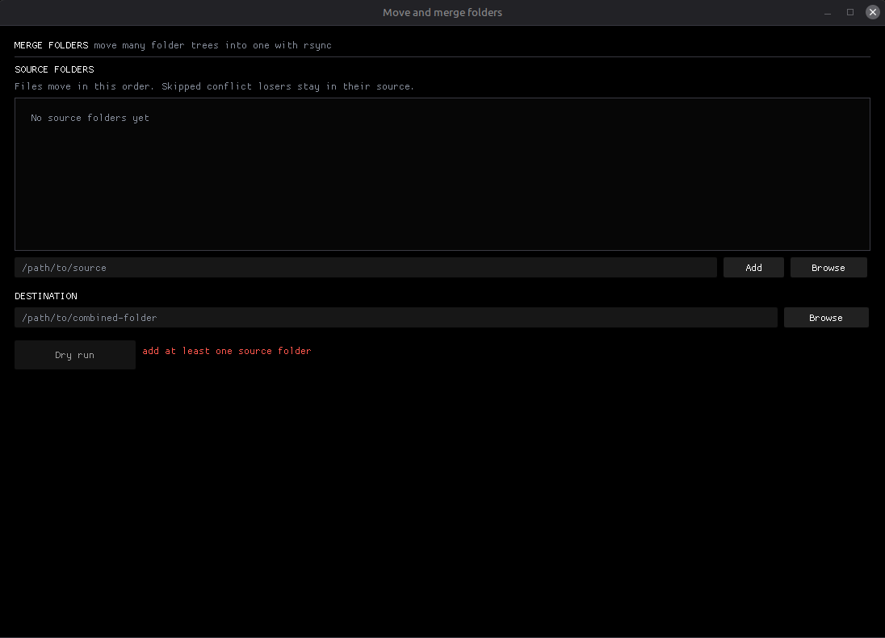

# Move and Merge Folders

A small Linux Dear ImGui app for moving several directory trees into one.
It always runs rsync in dry-run mode first, discovers overlapping files and
file/folder shape clashes, asks which copy to keep, then performs the move.

</img>

## Behavior

- Add source folders in the order they should be moved and layered.
- Choose one destination folder. A new final folder name may be typed directly.
- Run the mandatory dry run. No merge button exists before it succeeds.
- Conflicts default to keeping every copy. Extra copies are renamed with a
  suffix such as `_collision_0001.ext`, skipping names that already exist.
- Resolve conflicts individually, or use the rename, destination, and latest
  source bulk choices.
- Move. Directories and unique files combine automatically. No unrelated
  destination files are deleted.

Successful rsync transfers use `--remove-source-files`. Once every transfer has
succeeded, the app removes source directories only when they are empty. Files
excluded by a conflict choice remain in their source tree. Source trees must be
idle while moving, since rsync cannot safely remove a file that another program
is still writing.

Local moves explicitly use `--whole-file` and `--no-compress`. This avoids CPU
work for delta matching and compression that does not help local disk moves.

Source paths use a trailing slash when passed to rsync, so the contents of each
folder land directly in the destination. Rsync is launched with `fork` and
`execvp`, never a shell. Spaces and shell characters in paths stay literal.

The destination and any source may not contain one another. This prevents a
merge from recursively ingesting its own output. Symlinked directories are not
followed while conflicts are inspected.

## Build

Requirements are a C++20 compiler, CMake, OpenGL development files, X11
development files, and `rsync` on `PATH`. CMake fetches GLFW and Dear ImGui.

```sh
cmake -S . -B build -DCMAKE_BUILD_TYPE=Release
cmake --build build -j
ctest --test-dir build --output-on-failure
./build/merge-folders
```
